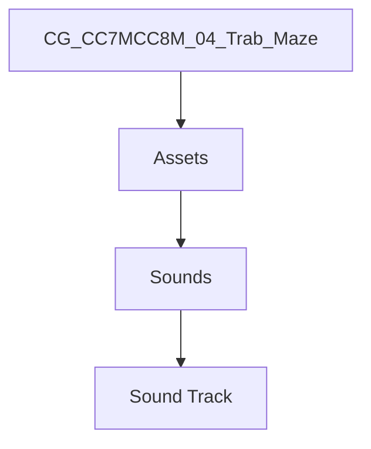

# CG_CC7MCC8M_04_Trab_Maze
### Trabalho apresentado dia 07/06/2023

ps.: quando baixar o arquivo, antes de exetutar abra o google drive baixe a musica [skyrim-music-ambience-night.mp3](https://drive.google.com/file/d/1rATJ3GdedhjwllEQml0JWAL-VbChhlD3/view?usp=sharing) e adicione na pasta do projeto, depois disso, verifique a versao do unity (tem que ser versao de preferencia entre 2018 a 2021 no maximo)

exemplo do caminho:

adendo: tem que ser na pasta Sound Track dentro do arquivo baixado do github e abre as pastas até achar a pasta certa

#### contribuidores:

> Gustavo Vazzoler Spelta;
>
> Marcos Tirelo Soromenho;
>
> Pedro Guilherme Schmid de Abreu;
>
> Suellen Miranda Amorim;
